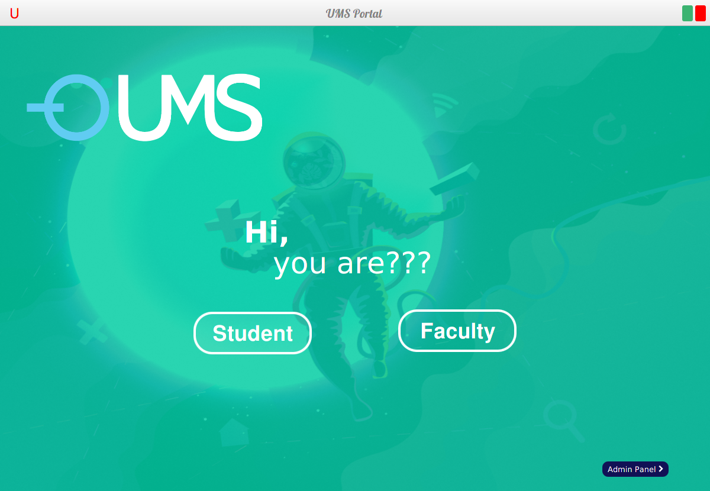
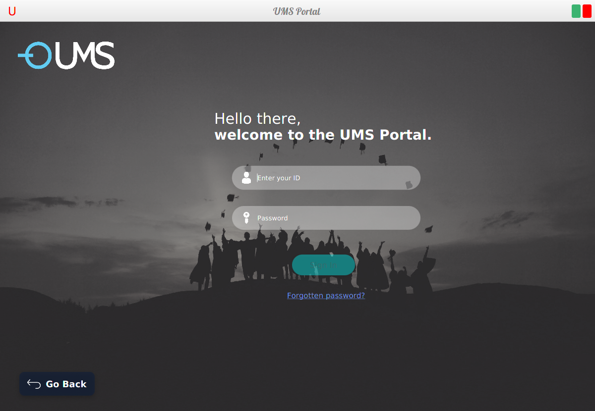
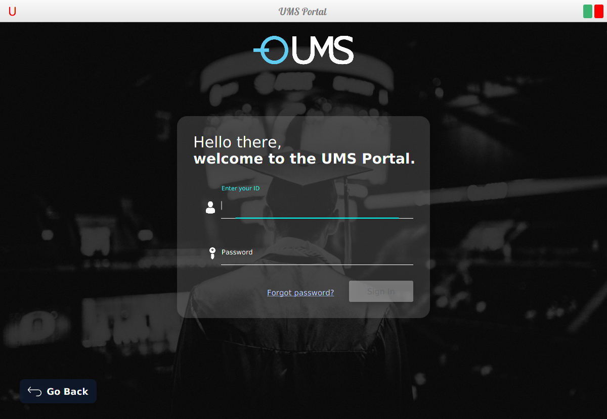
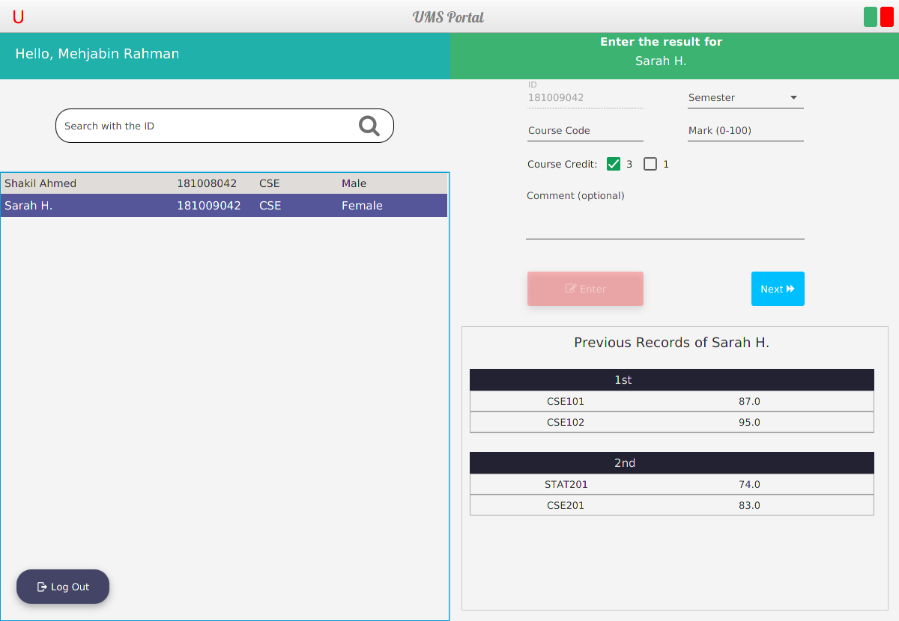
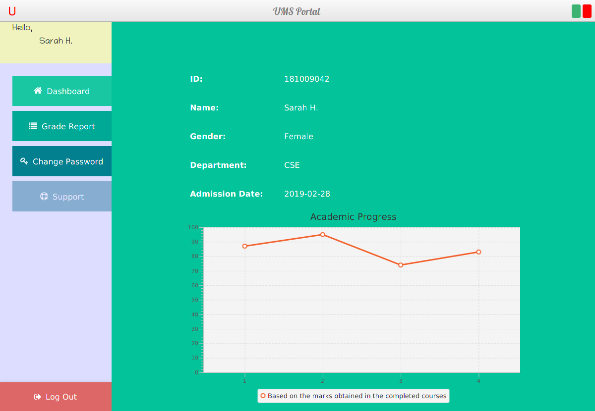
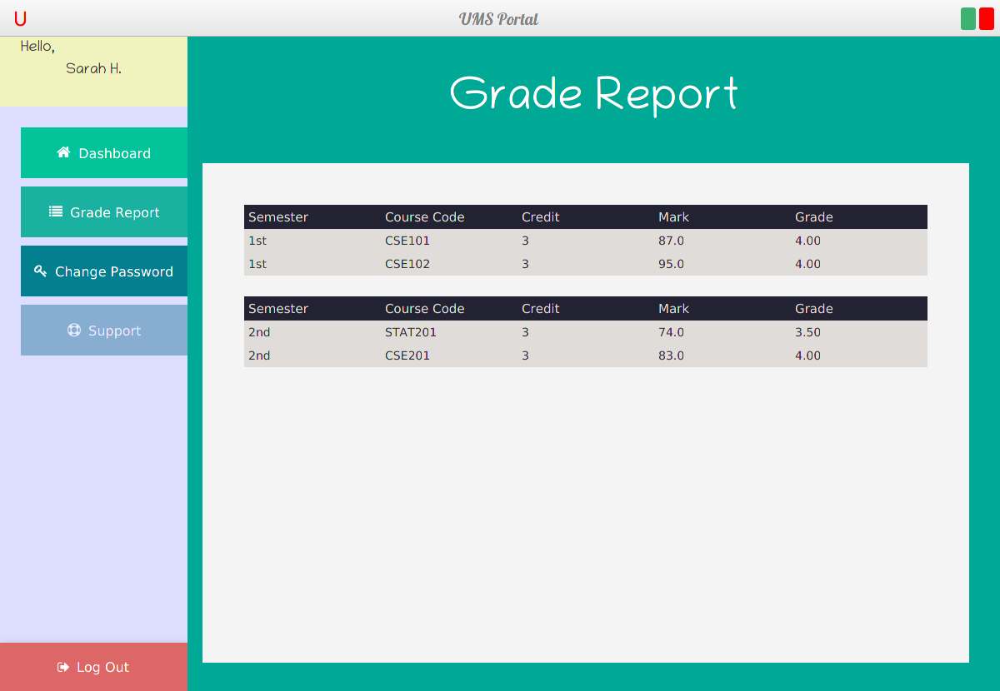

# UMS
First-year Project for my Java OOP course, made with JavaFX, JFOENIX and MongoDB.

# Screenshots
Welcome Page

# Admin Login
Login => |ID: root, Password: toor| (hardcoded)

# Student Login

# Teacher Login

# Result Inserting Page
Includes searching with ID and jumping to next ID for ease of use

# Student Dashboard
The chart is generated automatically based on the marks obtained from the course completed

# Student Grade Report

